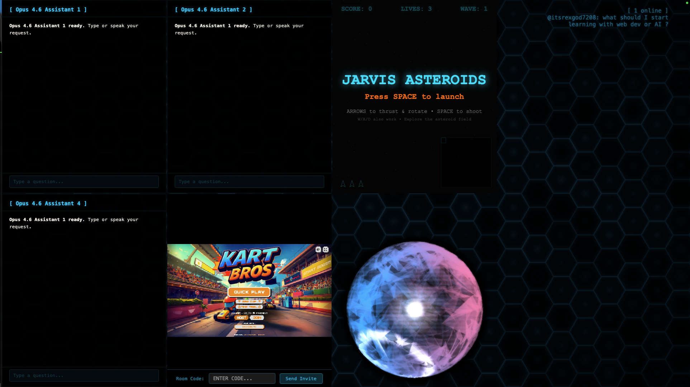

# Jarvis

A multiplayer vibe coding experience — games, chats, and vibes.



Jarvis is a shared desktop environment where multiple AI assistants, retro arcade games, live chat, and a 3D Metal-rendered orb all coexist on one screen. Connect with friends, play Asteroids or Kart Bros, talk to Opus 4.6 assistants, and vibe — all at once.

## Features

- **Multiplayer AI Assistants** — Up to 4 Claude Opus 4.6 chat panels running simultaneously
- **Arcade Games** — Jarvis Asteroids, Kart Bros, and more embedded directly in the HUD
- **Live Chat** — Real-time online chat with room codes and invite links
- **3D Metal Orb** — A reactive, animated orb rendered with Apple's Metal framework
- **Voice Input** — Push-to-talk with local Whisper transcription
- **Vibe Coding** — Ask the AI assistants to help you build, debug, and ship code live on stream

## Architecture

```
main.py                  Python entry point — mic capture, Metal bridge, event loop
metal-app/               Swift/Metal frontend — 3D orb, hex grid, chat panels
skills/                  Modular AI skill system
  router.py              Gemini conversation + tool routing
  claude_code.py         Claude Agent SDK integration (code assistant)
  code_assistant.py      Gemini function declarations for code tools
  code_tools.py          Tool dispatch (file ops, bash, search)
  domains.py             Domain drop hunting dashboard
  papers.py              arXiv paper matching dashboard
  firewall.py            Stream chat moderation (Great Firewall)
  vibetotext.py          Voice transcription stats
voice/                   Audio capture and transcription
  audio.py               Push-to-talk mic capture (Left Control)
  whisper_client.py      Local Whisper transcription
  realtime_client.py     Real-time API client
connectors/              External service integrations
  claude_proxy.py        OpenAI-compatible proxy for Claude (CLIProxyAPI)
  token_tracker.py       Token usage tracking across models
  sqlite_reader.py       Database reading utilities
  http_client.py         Async HTTP client wrapper
```

## Setup

### Prerequisites

- macOS 13+
- Python 3.10+
- Swift 5.9+
- Claude Max subscription (for Claude Code / Agent SDK features)
- Google Gemini API key (optional — enables Gemini-powered voice routing and skills)

### Install

```bash
# Python dependencies
cd jarvis
python3 -m venv .venv
source .venv/bin/activate
pip install -r requirements.txt

# Build the Metal app
cd metal-app
swift build
```

### Environment

Create a `.env` file in the project root:

```
CLAUDE_CODE_OAUTH_TOKEN=your-oauth-token
GOOGLE_API_KEY=your-gemini-api-key        # optional
```

### Claude OAuth Token Setup

The code assistant skill uses the Claude Agent SDK, which authenticates via an OAuth token from your Claude Max subscription. Run the login script to set this up:

```bash
./login.sh
```

This does the following:

1. Runs `claude auth login` to open the browser-based OAuth flow
2. After you authenticate, it extracts the access token from the macOS Keychain (`Claude Code-credentials`)
3. Writes the token to `.env` as `CLAUDE_CODE_OAUTH_TOKEN`

The token expires periodically — re-run `./login.sh` whenever the code assistant stops authenticating.

## Run

```bash
./start.sh
```

This activates the virtualenv and runs `main.py`, which launches the Metal frontend and starts listening for voice input.

### Controls

- **Left Control** (hold) — push-to-talk
- **Option + Period** — push-to-talk (Metal app hotkey)
- **Cmd + G** — toggle hotkey overlay
- **Escape** — quit

## Skills

Jarvis routes voice input through Gemini, which can invoke tools to activate different skills:

| Skill | Trigger | What it does |
|-------|---------|--------------|
| Code Assistant | "help me with code", "look at this project" | Launches a Claude Agent SDK session with full file/bash/search tools |
| Domains | "check domains", "any good drops?" | Queries the domain drop hunter for today's matched domains |
| Papers | "any new papers?", "check arXiv" | Shows today's arXiv paper matches by interest area |
| Firewall | "how's chat?", "any bans?" | Stream chat moderation stats from Great Firewall |
| VibeToText | "transcription stats" | Voice-to-text session statistics |


